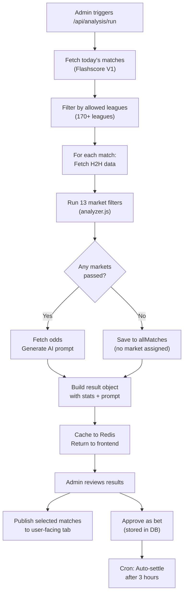
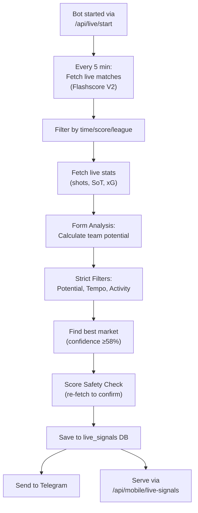

# SENTIO PICKS (Goalify AI) — System Overview

> **Last updated:** 2026-03-16  
> **Status:** Production · Deployed on Render.com (backend) + Cloudflare Pages (frontend)

---

## 1. What Is This Project?

SENTIO PICKS is an **AI-powered football match analysis and live betting signal platform**. It scrapes football match data from Flashscore (via RapidAPI), runs statistical analysis through 13 market filters, generates trading signals in real-time with two autonomous bots, and serves predictions to end users through a web dashboard, mobile apps, Telegram channel, and Excel/Google Sheets exports sold as a product on Etsy.

**Brand names used interchangeably:** GoalSniper Daily, Goalify AI, SENTIO PICKS.

---

## 2. High-Level Architecture

```
┌──────────────────────────────────────────────────────────────────┐
│                         CLIENTS                                  │
│  ┌───────────┐  ┌───────────┐  ┌─────────┐  ┌────────────────┐ │
│  │  Web App   │  │ Flutter   │  │  React  │  │  Telegram Bot  │ │
│  │  (Vite +   │  │  (sentio  │  │ Native  │  │  (channel      │ │
│  │  React +   │  │  _app)    │  │ (sentio │  │   messages)    │ │
│  │  Shadcn)   │  │           │  │  _rn)   │  │                │ │
│  └─────┬──────┘  └─────┬─────┘  └────┬────┘  └────────┬───────┘ │
│        └───────────────┼─────────────┘                 │         │
│                        ▼                               │         │
│              ┌──────────────────┐                      │         │
│              │   Express.js     │──────────────────────┘         │
│              │   Backend API    │                                │
│              │   (server.js)    │                                │
│              └────────┬─────────┘                                │
└───────────────────────┼──────────────────────────────────────────┘
                        │
  ┌─────────────────────┼──────────────────────────┐
  │                     │          EXTERNAL         │
  │   ┌────────────┐ ┌──┴──────┐ ┌──────────────┐  │
  │   │  Turso DB  │ │ Upstash │ │  Flashscore   │  │
  │   │  (LibSQL)  │ │  Redis  │ │  (RapidAPI)   │  │
  │   └────────────┘ └─────────┘ └──────────────┘  │
  │   ┌────────────┐ ┌─────────┐ ┌──────────────┐  │
  │   │  Firebase  │ │ Creem.io│ │   Telegram    │  │
  │   │  Admin SDK │ │ Payments│ │   Bot API     │  │
  │   └────────────┘ └─────────┘ └──────────────┘  │
  └─────────────────────────────────────────────────┘
```

---

## 3. Project Structure

```
goalify-ai-main/
├── backend/                      # Node.js Express API server
│   ├── server.js                 # Main entry point (1700 lines, 30+ routes)
│   ├── lib/
│   │   ├── flashscore.js         # RapidAPI client (V1 + V2 endpoints)
│   │   ├── analyzer.js           # Daily pre-match analysis engine (13 market filters)
│   │   ├── database.js           # Turso/LibSQL ORM layer
│   │   ├── redis.js              # Upstash Redis caching & published matches
│   │   ├── auth.js               # JWT auth + bcrypt + middleware
│   │   ├── firebase.js           # Firebase Admin SDK init
│   │   ├── telegram.js           # Telegram Bot API notifications
│   │   ├── creem.js              # Creem.io payment gateway
│   │   ├── settlement.js         # Auto-settlement for daily bets
│   │   ├── liveBot.js            # Live Bot — form-based Over/Goal signals
│   │   ├── liveDeadBot.js        # Dead Bot — Under/No Goal signals
│   │   ├── liveStrategies.js     # Momentum strategies (First Half / Late Game)
│   │   ├── liveDeadStrategies.js # 6 dead-match strategies
│   │   ├── liveFormAnalysis.js   # Team potential calculator for live bot
│   │   ├── liveMomentum.js       # Momentum detection (shots/corners/SoT)
│   │   ├── liveAntiMomentum.js   # Anti-momentum / collapse detection
│   │   ├── liveH2H.js           # H2H analysis for dead bot
│   │   └── liveSettlement.js     # Auto-settlement for live signals
│   ├── data/
│   │   └── leagues.js            # 170+ allowed leagues whitelist
│   ├── render.yaml               # Render.com deployment config
│   └── package.json
│
├── frontend/                     # Vite + React + TypeScript + Shadcn/UI + TailwindCSS
│   ├── src/
│   │   ├── App.tsx               # Root component with routing
│   │   ├── components/           # UI components (dashboard, auth, layout, landing)
│   │   └── ...                   # 94 source files total
│   ├── vercel.json               # Cloudflare/Vercel deploy config
│   └── package.json
│
├── sentio_app/                   # Flutter mobile app (Android/iOS)
│   ├── lib/                      # Dart source
│   └── pubspec.yaml
│
├── sentio_rn/                    # React Native mobile app (Expo)
│   ├── src/                      # TypeScript source
│   ├── App.tsx
│   └── package.json
│
├── growth/                       # Marketing assets
│   ├── twitter-sniper.js         # Twitter growth automation script
│   ├── twitter-extension/        # Chrome extension for Twitter
│   └── etsy-product/             # Etsy listing assets
│
├── scripts/
│   └── make_admin.js             # Utility to promote a user to admin
│
└── docs (root-level)
    ├── SYSTEM_DOCUMENTATION.md
    ├── SENTIO_FLUTTER_DESIGN_SPEC.md
    ├── SENTIO_PICKS_Customer_Guide.md
    └── README.md
```

---

## 4. Backend Modules — Detailed Breakdown

### 4.1 `server.js` — Express API Entry Point

The monolithic entry point defining **30+ API routes** organized in sections:

| Section | Routes | Purpose |
|---|---|---|
| **Auth** | `POST /api/auth/register`, `login`, `GET /me`, `POST /firebase-sync` | User registration, login, Firebase token sync |
| **Analysis** | `POST /api/analysis/run`, `GET /api/analysis/results` | Daily pre-match analysis pipeline |
| **Publishing** | `POST /api/matches/publish`, `GET /api/public/matches`, `DELETE /api/matches/published` | Admin publishes analyzed matches for users |
| **Bets** | `POST /api/bets/approve`, `GET /approved`, `GET /pending`, `DELETE /:id` | Admin bet approval workflow |
| **Settlement** | `POST /api/settlement/run`, `GET /status`, `POST /manual/:id`, `POST /trigger` | Auto + manual bet settlement |
| **Training** | `GET /api/training/all`, `GET /stats`, `DELETE /:id`, `DELETE /` | Historical training data management |
| **Live Bot** | `POST /api/live/start`, `stop`, `scan`, `GET /signals`, `status`, `history` | Momentum live bot control |
| **Dead Bot** | `POST /api/dead/start`, `stop`, `scan`, `GET /status` | Dead match bot control |
| **Mobile** | `GET /api/mobile-bets`, `POST`, `PATCH`, `DELETE` | Mobile app bet management |
| **Mobile Live** | `GET /api/mobile/live-signals`, `live-history` | Mobile live signal access (premium-gated) |
| **Payments** | `POST /api/payments/checkout`, `POST /api/webhooks/creem` | Creem.io subscription payments |
| **Etsy** | `GET /api/etsy/daily`, `POST/GET/DELETE /api/admin/etsy-keys` | API key-protected data feed for Etsy Google Sheets product |
| **Export** | `POST /api/export/excel`, `POST /api/stats/publish`, `GET /api/public/stats` | Excel generation, public stats endpoint |
| **Admin** | `GET /api/admin/users`, `POST /:id/premium` | User management |
| **Health** | `GET /api/health` | System health check |

**Cron Jobs (via `node-cron`):**
- Settlement cycle: every 10 minutes
- Auto-settlement: every hour
- Live settlement: every 10 minutes

### 4.2 `analyzer.js` — Pre-Match Analysis Engine

Implements **13 market filters** that evaluate each match against statistical thresholds:

| # | Market | Key Criteria |
|---|---|---|
| 1 | Over 2.5 Goals | League avg ≥3.0, both teams O2.5 ≥70% |
| 2 | BTTS | Home scoring ≥85%, away scoring ≥80%, H2H BTTS ≥50% |
| 3 | 1X Double Chance | Home loss ≤1, away win <30% |
| 4 | Home Over 1.5 | Home avg scored ≥2.2, away conceded ≥1.6 |
| 5 | Under 3.5 | League avg <2.4, both U3.5 ≥80% |
| 6 | Under 2.5 | League avg <2.5, both U2.5 ≥75% |
| 7 | First Half Over 0.5 | HT goal verification via match details API |
| 8 | MS1 & 1.5 Üst | Home win ≥60%, scored ≥1.9, away conceded ≥1.2 |
| 9 | Dep 0.5 Üst | Away scoring ≥80%, home non-CS ≥80% |
| 10 | Handicap (-1.5) | Win ≥70%, goal diff ≥1.8 |
| 11 | 1X + 1.5 Üst | Composite: loss ≤1, league avg ≥2.3, O1.5 ≥70% |
| 12 | Ev Herhangi Yarı | Either half win ≥70%, verified via match details |
| 13 | Dep DNB | Away win ≥45%, loss ≤1, home win <45% |

Also generates:
- AI prompts (for ChatGPT/Claude) with detailed stats
- Detailed stats with half-time enrichment for user-facing tabs

### 4.3 `liveBot.js` — Live Match Bot (Goal Signals)

Autonomous bot scanning live matches every **5 minutes** for Over/Goal signals:
1. Fetches live matches via Flashscore V2
2. Filters by league whitelist, time window (5-38' or 46-82'), score differential
3. Fetches live match stats (shots, SoT, corners, xG, possession)
4. Runs **form-based analysis** (`liveFormAnalysis.js`) — team potential calculation
5. Applies strict filters: minimum potential (≥0.9), tempo check, activity check
6. Score safety check (re-fetches to confirm score unchanged)
7. Saves signal to DB, sends to Telegram
8. Daily signal limits: 1 per match (first half), 2 per match (late game)

### 4.4 `liveDeadBot.js` — Dead Match Bot (Under/No Goal Signals)

Scans every **3 minutes** for Under/No Goal signals using 6 strategies:

| Strategy | Time Window | Condition | Market |
|---|---|---|---|
| FH Lock | 30-42' | 0-0, dead stats | IY Under 0.5 |
| Sleepy FH | 25-38' | 0-0, <3 shots, <2 corners | IY 0-0 |
| Tactical Stalemate | 35-43' | 0-0 or 1-1, momentum collapse | HT score |
| Late Lock | 65-80' | Low activity, ≤1 goal diff | No more goals |
| Scoreless Stalemate | 55-75' | 0-0, low xG | 0-0 or U1.5 |
| Parked Bus | 60-82' | 1-0 or 2-0, leading team static | No more goals |

Includes **H2H validation** and **anti-momentum collapse detection**.

### 4.5 `settlement.js` — Bet Settlement Engine

Settles 25+ market types: Over/Under (0.5-4.5), BTTS, 1X2, Double Chance, DNB (with REFUND), Home/Away goals, First/Second Half, Handicap, combination markets (BTTS+O2.5, DC+Goals), Either Half Win.

Settlement delay: **3 hours** after match time. Falls back to 4 hours from approval time.

---

## 5. Database Schema (Turso/LibSQL)

| Table | Purpose | Key Fields |
|---|---|---|
| `users` | User accounts | id, email, password_hash, firebase_uid, role, plan, is_premium |
| `approved_bets` | Admin-approved daily bets | match_id, market, odds, status (PENDING/WON/LOST/REFUND) |
| `training_pool` | Historical settled bet data | market, result, final_score, home_goals, away_goals |
| `mobile_bets` | Mobile app bet cards | bet_id, market, odds, status |
| `live_signals` | Live bot signal history | strategy, strategy_code, entry_score, entry_time, confidence |

---

## 6. Third-Party Integrations — Complete Reference

### 6.1 Flashscore API (via RapidAPI)

| Attribute | Detail |
|---|---|
| **Purpose** | Football match data: fixtures, H2H, match details, odds, live scores, live stats |
| **Provider** | RapidAPI → `flashscore4.p.rapidapi.com` |
| **Implementation** | [flashscore.js](file:///c:/Users/p0wze/.gemini/antigravity/scratch/goalify-ai-main/backend/lib/flashscore.js) |
| **API Versions** | V1 (daily analysis, H2H, details, odds) + V2 (live matches, live stats) |
| **Env Vars** | `RAPIDAPI_KEY` (daily), `RAPIDAPI_KEY_LIVE` (live bots, optional — falls back to main key) |
| **Rate Limit** | 60 RPM per key. Mitigated with `fetchWithRetry()` (5 retries, exponential backoff), `sleep()` between requests |
| **Endpoints Used** | `/v1/match/list/{day}`, `/v1/match/h2h/{id}`, `/v1/match/details/{id}`, `/v1/match/odds/{id}`, `/v1/match/live/1`, `/v1/match/stats/{id}`, `/v2/matches/live`, `/v2/matches/match/stats` |
| **Vendor Lock** | **HIGH** — Core data dependency. No alternative configured. All analysis/bots depend on this API. |
| **Migration Risk** | Would require rewriting all parsing logic. Response format differs between V1/V2. |

---

### 6.2 Upstash Redis

| Attribute | Detail |
|---|---|
| **Purpose** | Caching (analysis results, published matches), rate limiting, stats counters, settlement status, Etsy API key store, public stats storage |
| **Implementation** | [redis.js](file:///c:/Users/p0wze/.gemini/antigravity/scratch/goalify-ai-main/backend/lib/redis.js) |
| **Env Vars** | `UPSTASH_REDIS_REST_URL`, `UPSTASH_REDIS_REST_TOKEN` |
| **SDK** | `@upstash/redis` (REST-based, serverless-friendly) |
| **Key Prefixes** | `goalsniper:analysis:*`, `goalsniper:settlement:*`, `goalsniper:ratelimit:*`, `goalsniper:stats:*`, `goalsniper:published:*`, `goalsniper:etsy:*`, `public:etsy:*` |
| **TTLs** | Analysis cache: 1h, Published matches: 24h, Settlement status: 24h |
| **Graceful Degradation** | All Redis calls fail gracefully — system works without Redis using in-memory fallback |
| **Vendor Lock** | **LOW** — Uses standard Redis commands via REST. Could swap to any Redis provider. |

---

### 6.3 Turso (LibSQL)

| Attribute | Detail |
|---|---|
| **Purpose** | Primary database: users, bets, training data, live signals, mobile bets |
| **Implementation** | [database.js](file:///c:/Users/p0wze/.gemini/antigravity/scratch/goalify-ai-main/backend/lib/database.js) |
| **Env Vars** | `TURSO_DATABASE_URL`, `TURSO_AUTH_TOKEN` |
| **SDK** | `@libsql/client` |
| **Local Fallback** | `file:local.db` (SQLite file) when no remote URL configured |
| **Schema** | 5 tables: `users`, `approved_bets`, `training_pool`, `mobile_bets`, `live_signals` |
| **Vendor Lock** | **LOW** — LibSQL is SQLite-compatible. Can run on local SQLite or any SQLite host. |

---

### 6.4 Firebase Admin SDK

| Attribute | Detail |
|---|---|
| **Purpose** | Server-side ID token verification for Firebase Authentication (Google/Apple sign-in from mobile apps) |
| **Implementation** | [firebase.js](file:///c:/Users/p0wze/.gemini/antigravity/scratch/goalify-ai-main/backend/lib/firebase.js), used in `/api/auth/firebase-sync` route |
| **Env Vars** | `FIREBASE_SERVICE_ACCOUNT` (JSON string of service account credentials) |
| **SDK** | `firebase-admin` |
| **Usage** | `verifyIdToken()` — validates client-sent ID tokens, creates/links users in local DB |
| **Vendor Lock** | **MEDIUM** — Firebase Auth is used for mobile sign-in. Replacing requires changing both backend verification and mobile client auth flow. |

---

### 6.5 Creem.io (Payments)

| Attribute | Detail |
|---|---|
| **Purpose** | Subscription payment processing (monthly/yearly PRO plans) |
| **Implementation** | [creem.js](file:///c:/Users/p0wze/.gemini/antigravity/scratch/goalify-ai-main/backend/lib/creem.js) |
| **Env Vars** | `CREEM_API_KEY` |
| **API** | REST, `https://api.creem.io/v1` (prod) / `https://test-api.creem.io/v1` (test) |
| **Endpoints** | `POST /checkouts` (create checkout session) |
| **Webhooks** | `POST /api/webhooks/creem` — handles `checkout.completed`, `subscription.expired`, `subscription.canceled` |
| **Products** | Monthly: `prod_1k9SeBnQF1PGFE9GOD4rmZ`, Yearly: `prod_7NvE42XjRyjARYQHhxAqRE` |
| **Flow** | 1. Backend creates checkout → 2. User redirected to Creem → 3. Webhook fires → 4. User upgraded to PRO in DB |
| **Vendor Lock** | **LOW** — Simple checkout + webhook pattern. Can be replaced with Stripe/Paddle easily. No webhook signature verification currently. |

---

### 6.6 Telegram Bot API

| Attribute | Detail |
|---|---|
| **Purpose** | Real-time signal notifications to Telegram channel/group |
| **Implementation** | [telegram.js](file:///c:/Users/p0wze/.gemini/antigravity/scratch/goalify-ai-main/backend/lib/telegram.js) |
| **Env Vars** | `TELEGRAM_BOT_TOKEN`, `TELEGRAM_CHAT_ID` |
| **Message Types** | Momentum signals, Dead match signals, Form-based signals, Bot status (start/stop), Settlement results |
| **Format** | HTML parse mode with emoji-rich formatting (Turkish language) |
| **Graceful Degradation** | Skips silently if not configured |
| **Vendor Lock** | **NONE** — Standard Telegram Bot API, no SDK dependency. |

---

### 6.7 ExcelJS

| Attribute | Detail |
|---|---|
| **Purpose** | Generates branded `.xlsx` files for Etsy product (daily analysis spreadsheets) |
| **Implementation** | Inline in `server.js` (`POST /api/export/excel`) |
| **Sheets Generated** | 1. Overview (color-coded stats table) 2. User Guide 3. AI Prompt (copy-paste for ChatGPT) |
| **Vendor Lock** | **NONE** — Pure library, no service dependency. |

---

### 6.8 Groq API (Referenced but not actively called)

| Attribute | Detail |
|---|---|
| **Purpose** | Listed in `.env.example` as `GROQ_API_KEY` | 
| **Current Status** | **Not used in any backend code.** The analyzer generates prompts but does NOT call any LLM API — prompts are given to users to paste into ChatGPT/Claude manually. |
| **Env Var** | `GROQ_API_KEY` (configured but unused) |

---

### 6.9 Puppeteer (Referenced but not actively called)

| Attribute | Detail |
|---|---|
| **Purpose** | Listed as a dependency in `package.json` |
| **Current Status** | **Not imported or used** in any backend module. Likely a legacy dependency from earlier scraping attempts. |

---

## 7. Environment Variables — Complete List

| Variable | Required | Used By | Description |
|---|---|---|---|
| `RAPIDAPI_KEY` | ✅ **Critical** | flashscore.js | Flashscore API key for daily analysis |
| `RAPIDAPI_KEY_LIVE` | Optional | flashscore.js | Separate key for live bots (falls back to main) |
| `TURSO_DATABASE_URL` | ✅ | database.js | Database URL (`libsql://` or `file:local.db`) |
| `TURSO_AUTH_TOKEN` | Prod only | database.js | Auth token for remote Turso DB |
| `UPSTASH_REDIS_REST_URL` | ✅ | redis.js | Upstash Redis REST endpoint |
| `UPSTASH_REDIS_REST_TOKEN` | ✅ | redis.js | Upstash Redis auth token |
| `FIREBASE_SERVICE_ACCOUNT` | Mobile auth | firebase.js | JSON string of Firebase service account |
| `CREEM_API_KEY` | Payments | creem.js | Creem.io payment API key |
| `TELEGRAM_BOT_TOKEN` | Notifications | telegram.js | Telegram bot token |
| `TELEGRAM_CHAT_ID` | Notifications | telegram.js | Target chat/channel ID |
| `JWT_SECRET` | ✅ | auth.js | JWT signing secret (has a hardcoded fallback ⚠️) |
| `GROQ_API_KEY` | ❌ Unused | — | Not referenced in code |
| `ADMIN_PASSWORD` | Optional | server.js | Legacy admin backdoor password |
| `PORT` | Optional | server.js | Server port (default: 3001) |

---

## 8. Data Flow — Analysis Pipeline



---

## 9. Data Flow — Live Bot Pipeline



---

## 10. Frontend Architecture

- **Framework:** Vite + React 18 + TypeScript
- **UI:** Shadcn/UI components (Radix primitives) + TailwindCSS
- **State:** TanStack React Query
- **Routing:** React Router v6
- **Charts:** Recharts
- **Deployment:** Cloudflare Pages (sentiopicks.com, sentio.pages.dev)
- **CORS Origins:** `sentiopicks.com`, `goalify-ai.pages.dev`, `localhost:5173/3000/8081/19006`

### Key Pages (by component files):
- Dashboard (StatsCard, PerformanceChart, LiveMatchWidget, QuickActions, ActivityFeed)
- Landing page (Navbar, Footer)
- Auth (RequireAuth guard)
- Layout (Sidebar, Header, AppLayout)

---

## 11. Mobile Apps

### sentio_app (Flutter)
- Full Flutter app with Android/iOS/Web/Desktop targets
- Uses Firebase for authentication
- Connects to same backend API

### sentio_rn (React Native / Expo)
- Expo-based React Native app
- Firebase config: `google-services.json` (Android) + `GoogleService-Info.plist` (iOS)
- Uses Moti for animations

---

## 12. Deployment

| Component | Platform | Config File |
|---|---|---|
| Backend API | **Render.com** (free tier) | `backend/render.yaml` |
| Frontend Web | **Cloudflare Pages** | `frontend/vercel.json` |
| Flutter App | Manual build | `sentio_app/` |
| React Native | Expo build | `sentio_rn/` |

---

## 13. Monetization

1. **PRO Subscription** — via Creem.io (monthly / yearly). Upgrades `is_premium` flag, unlocks all published matches and live signals.
2. **Etsy Product** — Daily analysis Excel spreadsheet + Google Sheets auto-update script. Protected by API keys managed in Redis.
3. **Free tier** — Limited to 3 published matches per day.

---

## 14. Security Considerations

| Issue | Severity | Location |
|---|---|---|
| JWT secret has hardcoded fallback | ⚠️ Medium | `auth.js:5` |
| Legacy admin backdoor login | ⚠️ Medium | `server.js:182-188` |
| Hardcoded public stats access key | ⚠️ Low | `server.js:1664` |
| Creem webhook lacks signature verification | ⚠️ Medium | `creem.js:168-172` |
| CORS allows all origins (debug mode) | ⚠️ Medium | `server.js:107` |
| Firebase service account in env string | ℹ️ Info | `firebase.js` |

---

## 15. Glossary

| Term | Meaning |
|---|---|
| **IY / İY** | İlk Yarı (First Half in Turkish) |
| **MS** | Maç Sonucu (Match Result) |
| **KG** | Karşılıklı Gol (BTTS) |
| **Dep** | Deplasman (Away) |
| **Ev** | Ev Sahibi (Home) |
| **Üst** | Over |
| **Alt** | Under |
| **DNB** | Draw No Bet |
| **SoT** | Shots on Target |
| **xG** | Expected Goals |
